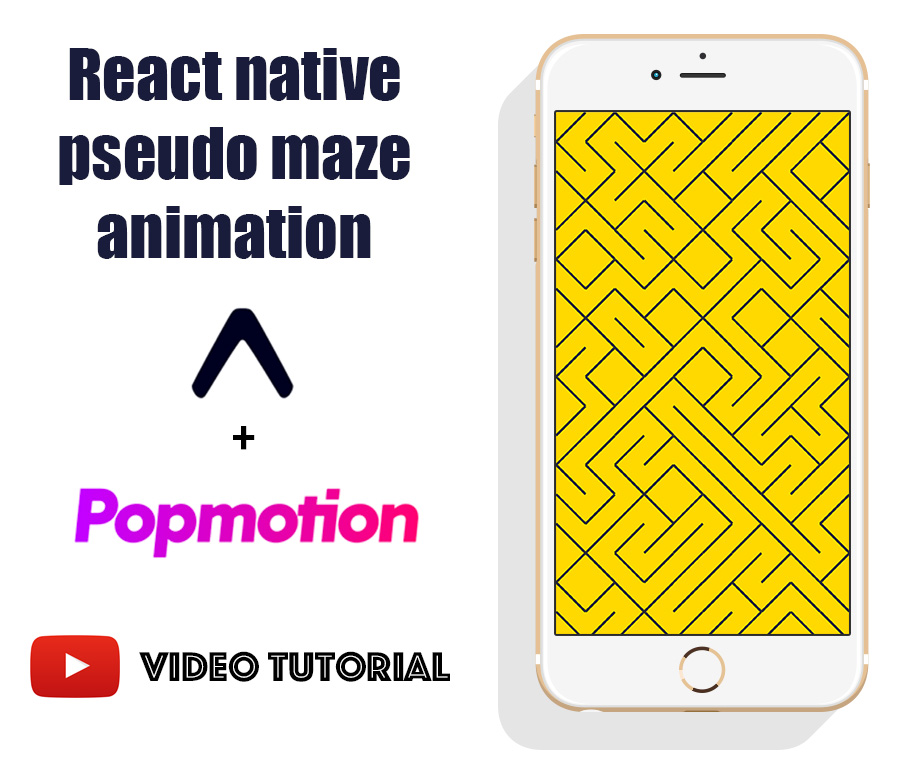

# React Native pseudo maze animation with Pose

Youtube tutorial:

In this lesson we’re going to be building a react native animation using pose library by Popmotion and Expo for creating the react-native project.

The grid explanation link url: http://www.cs.middlebury.edu/~candrews/classes/genart/assignment4.html
Expo: https://expo.io/
Popmotion Pose: https://popmotion.io/pose/

You can find me on:
Github: http://github.com/catalinmiron
Twitter: http://twitter.com/mironcatalin
